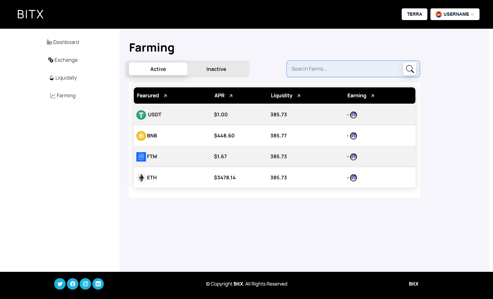

# Crypto Wallet dashboard built with reactjs
---

## Table of contents

  - [Overview](#overview)
  - [Timeframe](#timeline)
  - [Technologies](#Technologies)
  - [Screenshot](#screenshot)
  - [Links](#links)
  - [What I learned](#what-i-learned)
  - [Useful resources](#useful-resources)
  - [Author](#author)

---

## Overview

This is a crypto wallet web application for one of my client, I have built the frontend using reactjs. This a infact the dashboard with a simple business landing page as well. The dashboard has account overview & and balance portfolio. All the chart and graph is also there. Exchange of currency is available on the exchange page.

### Timeline
project working time was: `April-may 2022`

### Technologies

- React 
- React Hooks
- Bootstrap
- Font Awesome
- React Router

### Screenshot

#### Mobile View

### Links

- Live Link : [Live Link](https://bitx-platform.netlify.app)

### What I learned
The main objective of this project was to get hands-on experience by working with `reactjs` . I have also gained a lot of knowledge by creating this frontend application.

### Useful resources

[React - Doc](https://reactjs.org/) 
[React Router - Doc](https://reactrouter.com/web) 

---

## Author

- Linkedin - [Rakibul](https://linkedin.com/in/rakibul21)
